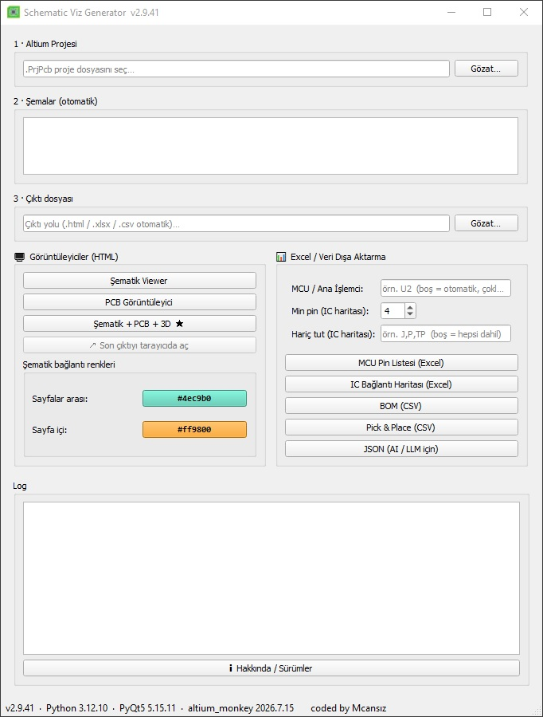
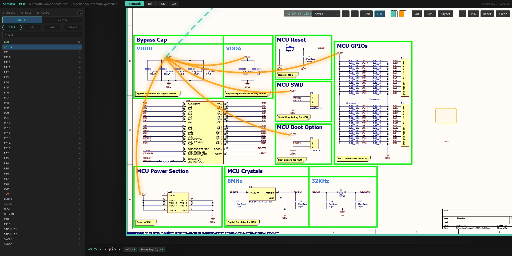
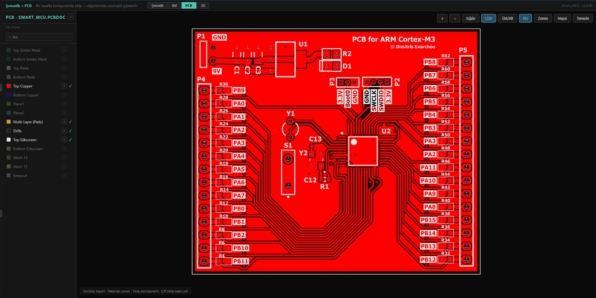
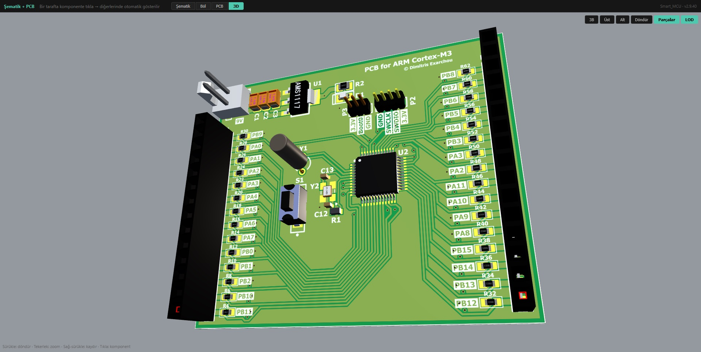

# Schematic Viz Generator

> Altium şematik ve PCB projelerini tek dosyalık, sunucu gerektirmeyen **interaktif HTML görüntüleyicilere** dönüştüren PyQt5 masaüstü uygulaması.


Wavenumber'ın ticari **"viz sch 1.0"** ürününün açık-kaynak alternatifi. Eli Hughes / Wavenumber'ın
[`altium_monkey`](https://github.com/wavenumber-eng/altium_monkey) kütüphanesi üzerine kuruludur.

Projeyi seçin, bir düğmeye basın — çıktı olarak **çift tıkla açılan, tek dosya, portable** bir HTML
(veya Excel/CSV/JSON) alın. Ne web sunucusu, ne kurulum, ne internet gerekir; `file://` ile açılır.



---

##  Öne Çıkanlar

- **İnteraktif Şematik Viewer** — Tüm sayfalar tek pan/zoom kanvasında, tıklanabilir net'ler ve komponentler, PDF gibi seçilip kopyalanabilir metinler.
- **PCB Görüntüleyici** — Altium benzeri tam ekran katman görüntüleyici; katman aç/kapa, bakır yol/net highlight, komponente tıkla → şematik ↔ PCB cross-probe.
- **Şematik + PCB + 3D tek HTML'de** — Yan yana, çift yönlü cross-probe; gerçek gömülü **STEP 3D modelleriyle** board önizlemesi.
- **Excel &amp; CSV çıktıları** — MCU pin listesi, IC bağlantı haritası, BOM, Pick &amp; Place.
- **AI/LLM dostu JSON** — Gerçek elektriksel bağlantı (pin → net), BOM ve varyant verisiyle kompakt dışa aktarma.
- **Not &amp; kutu araçları** — Şematik üzerine PDF editörü tarzı not/işaret ekleme, kaydetme.
- **Cross-platform** — Windows ve Linux; kodun tamamı `pathlib` ile OS-bağımsız.

---

## Ekran Görüntüleri

**İnteraktif şematik viewer** — tıklanabilir net'ler, bağlantı yayları, sol panelde net/komponent listesi:



**PCB görüntüleyici** — Altium benzeri katmanlı görünüm, bakır/net highlight, çift yönlü cross-probe:



**3D board** — gerçek gömülü STEP modelleriyle interaktif board önizlemesi:



---

##  Üretilen Çıktılar

Uygulama sekiz ayrı çıktı üretir:


| Çıktı                    | Format           | Açıklama                                                     |
| ------------------------ | ---------------- | ------------------------------------------------------------ |
| **Şematik Viewer**       | HTML (~30 MB)    | Gömülü SVG'lerle tek dosya interaktif şematik                |
| **PCB Görüntüleyici**    | HTML (~30-40 MB) | Tam ekran katmanlı PCB, net highlight, cross-probe           |
| **Şematik + PCB + 3D ★** | HTML (~45-50 MB) | Üçü tek dosyada, çift yönlü cross-probe + 3D                 |
| **MCU Pin Listesi**      | XLSX             | MCU merkezli pin listesi (fonksiyon/arayüz otomatik tespiti) |
| **IC Bağlantı Haritası** | XLSX             | IC gruplarına göre sinyal/arayüz tablosu                     |
| **BOM**                  | CSV              | Tüm parametre sütunlarıyla malzeme listesi                   |
| **Pick &amp; Place**     | CSV              | PCB yerleşim koordinatları (PCB gerekir)                     |
| **JSON**                 | JSON             | AI/LLM analizine uygun kompakt veri (pin→net, BOM, varyant)  |


---

##  Kurulum

### Gereksinimler

- **Python 3.10+** (Windows'ta 3.12 önerilir)
- Linux'ta `altium-monkey` bağımlılığı `wn-geometer` yalnızca `manylinux_2_39` wheel'i dağıttığından **glibc ≥ 2.39** gerekir (Ubuntu 24.04+ / Debian 13+). Eski dağıtımlarda `pip` `ResolutionImpossible` hatası verir.

### Bağımlılıklar

```bash
# Windows
py -3.12 -m pip install -r requirements.txt

# Linux
python3 -m pip install -r requirements.txt
```

`requirements.txt` tüm listeyi içerir: PyQt5, altium-monkey, openpyxl ve 3D görünüm için
zorunlu `cascadio` / `trimesh` / `numpy`.

> **Not:** Önerilen minimum `altium-monkey` sürümü **2026.6.21**'dir (dikey pin adı render düzeltmesi bu sürümde gelir).

---

##  Kullanım

```bash
# Windows
py -3.12 gui.py

# Linux
python3 gui.py
```

1. Açılan pencereden Altium proje dosyanızı (`.PrjPcb`) seçin.
2. İstediğiniz çıktı düğmesine basın.
3. Üretim bittiğinde çıktı proje klasörüne yazılır; HTML'ler tarayıcıda çift tıkla açılır.

> **İpucu:** HTML'i açtıktan sonra değişikliği görmüyorsanız **Ctrl+F5** ile cache'i temizleyerek yeniden açın.

### Klavye Kısayolları (HTML Viewer)


| Tuş             | İşlev                                       |
| --------------- | ------------------------------------------- |
| `/`             | Aramayı aç + odaklan                        |
| `Enter`         | Aramada ilk sonucu seç                      |
| `B`             | Sol paneli gizle/göster                     |
| `0`             | Görünümü sıfırla                            |
| `F`             | Son öğeye sığdır                            |
| `Esc`           | Seçimi/aracı temizle                        |
| `?`             | Kısayol yardımını aç                        |
| `1 / 2 / 3 / 4` | Birleşik görünümde Şematik / Böl / PCB / 3D |


---

##  Windows EXE Paketleme

```bash
py -3.12 -m PyInstaller --noconfirm --onefile --windowed --name "SchematicViz" ^
    --collect-all altium_monkey --collect-all PyQt5 ^
    --collect-all openpyxl --collect-all cascadio --collect-all trimesh ^
    --collect-all numpy ^
    --icon icon.ico --add-data "gui.ui;." --add-data "icon.ico;." gui.py
```

Kolaylık için `build_exe.bat` çift tıklanarak da çalıştırılabilir (proje dizinine geçer,
PyInstaller yoksa kurar, tüm bağımlılıkları toplar).

> Fresh bir Windows'ta exe açılmazsa **MS VC++ Redistributable** gerekir:
> [https://aka.ms/vs/17/release/vc_redist.x64.exe](https://aka.ms/vs/17/release/vc_redist.x64.exe)

Linux için `build_linux.sh` betiği mevcuttur.

---

##  Proje Yapısı

```
├── viewer.py       # Tüm üretim mantığı (HTML/JSON/CSV/XLSX üreticileri, APP_VERSION burada)
├── gui.py          # PyQt5 ana pencere, non-blocking üretim thread'i
├── gui.ui          # Qt Designer XML formu
├── requirements.txt
├── build_exe.bat   # Windows exe paketleme
├── build_linux.sh  # Linux paketleme
├── Doxyfile        # Doxygen dokümantasyon ayarı
└── CLAUDE.md       # Ayrıntılı mimari ve geliştirici notları
```

Geliştirici dokümantasyonu için `CLAUDE.md`; kaynak-kod dokümantasyonu için `doxygen Doxyfile`
(çıktı: `docs/html/index.html`).

---

##  Mimari Kısa Notlar

- **Tek-dosya HTML stratejisi**: SVG'ler gömülü, sunucu gerekmez, `file://` ile açılır — dosya büyük ama tamamen portable.
- **Gerçek netlist**: JSON/Excel çıktıları `compile_netlist()` ile derlenen gerçek pin→net bağlantısı içerir; PcbDoc varsa netler PCB'den yeniden kurularak fiziksel doğruluk sağlanır.
- **PyQt5** (PyQt6 değil): `app.exec_()` ve flat enum kullanımına dikkat.
- **SchDoc/PcbDoc bulma**: Üç kademeli, OS-bağımsız fallback — Windows'ta kaydedilip Linux'ta açılan projeler de sorunsuz çözülür.

---

##  Teşekkür

Bu proje [`altium_monkey`](https://github.com/wavenumber-eng/altium_monkey)
(Eli Hughes / [Wavenumber](https://github.com/wavenumber-eng)) kütüphanesi üzerine kuruludur.
Altium dosya formatlarının okunması bu kütüphane sayesinde mümkündür.

---

## 📄 Lisans

Bu proje **GNU Affero General Public License v3.0 veya üzeri (AGPL-3.0-or-later)** ile
lisanslanmıştır — tam metin için [`LICENSE`](LICENSE) dosyasına bakın.

Bu lisans bir tercih değil, zorunluluktur: çekirdek bağımlılık
[`altium_monkey`](https://github.com/wavenumber-eng/altium_monkey) **AGPL-3.0** ve GUI
kütüphanesi **PyQt5 GPL v3** olduğundan, birleşik eser AGPL-3.0 altında dağıtılmak
zorundadır. Diğer bağımlılıklar (wn-geometer, openpyxl, cascadio, trimesh, numpy — MIT/BSD)
izin vericidir ve sorun oluşturmaz.

**Uygulama kaynağını dağıtmak** (exe veya kod olarak) ya da **ağ üzerinden hizmet olarak
sunmak**, kaynak kodun AGPL-3.0 altında sunulmasını gerektirir.

> **Not:** Bu araçla **üretilen HTML/Excel/CSV/JSON çıktıları** programın *çıktısıdır* ve
> AGPL kapsamında türev eser sayılmaz — ürettiğiniz görüntüleyicileri serbestçe
> paylaşabilirsiniz. Bulaşıcılık yalnızca uygulamanın *kendi kaynağını* bağlar.

